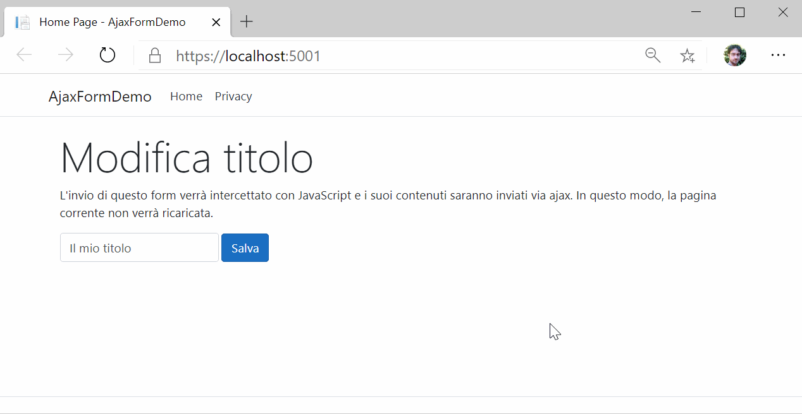

# Intercettazione dell'invio di un form
Questa applicazione ASP.NET Core MVC dimostra come usare JavaScript per intercettare l'invio di un form, così da evitare che la pagina si ricarichi completamente. I dati sono inviati al server con una richiesta Ajax grazie a jQuery.



## Parti interessanti
Nella view [Views/Home/Index.cshtml](Views/Home/Index.cshtml) si trova un `form` il cui invio viene intercettato da una funzione JavaScript chiamata `sendAjax`. Notare come il nome della funzione sia stato indicato sull'attributo `onsubmit` del `form`.

 Inoltre è stato indicato `return false` che inibirà l'invio e perciò eviterà il ricaricamento di pagina.

```
 <form method="post" asp-action="Edit" onsubmit="sendAjax(this); return false;" class="form-inline">
    <!-- Qui caselle e bottone -->
 </form>
```

Sempre all'interno della view [Views/Home/Index.cshtml](Views/Home/Index.cshtml) si trova la funzione JavaScript `sendAjax` che si occupa di recuperare i dati dal form e inviarli con una richiesta Ajax grazie a jQuery.
 ```
<script>
   function sendAjax(form) {
       //Riceviamo il form come parametro
       //Da esso attingiamo il metodo e la destinazione della richiesta
       $.ajax({
           type: form.method,
           url: form.action,
           data: $(form).serialize(),
           success: function(data) {
               //Il parametro data contiene la risposta del server
               alert("Il form è stato inviato senza causare ricaricamenti di pagina!\nIl server ha risposto: '" + data.status + "'");
           }
       });
   }
</script>
 ```

Lato server, l'action `Edit` del `HomeController` riceve i dati del form, li elabora e poi restituisce una risposta JSON per far sapere al client che tutto si è svolto correttamente.

```
[HttpPost]
public IActionResult Edit(TitleEditInputModel inputModel)
{
    //TODO: Qui elaboriamo i dati che abbiamo ottenuto
    //Poi restituiamo la risposta al client
    return Json(new { success = true, status = "Il nuovo valore è: " + inputModel.Title });
}
```